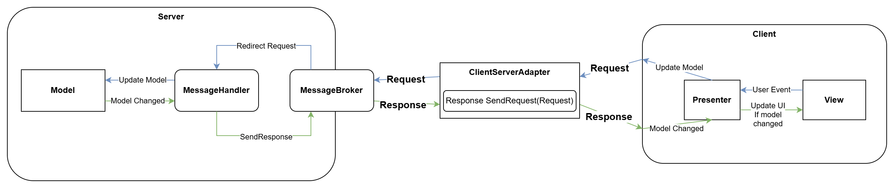
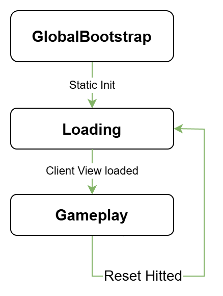
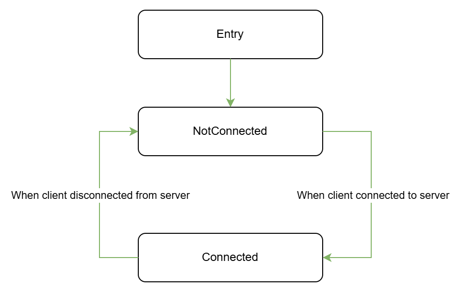
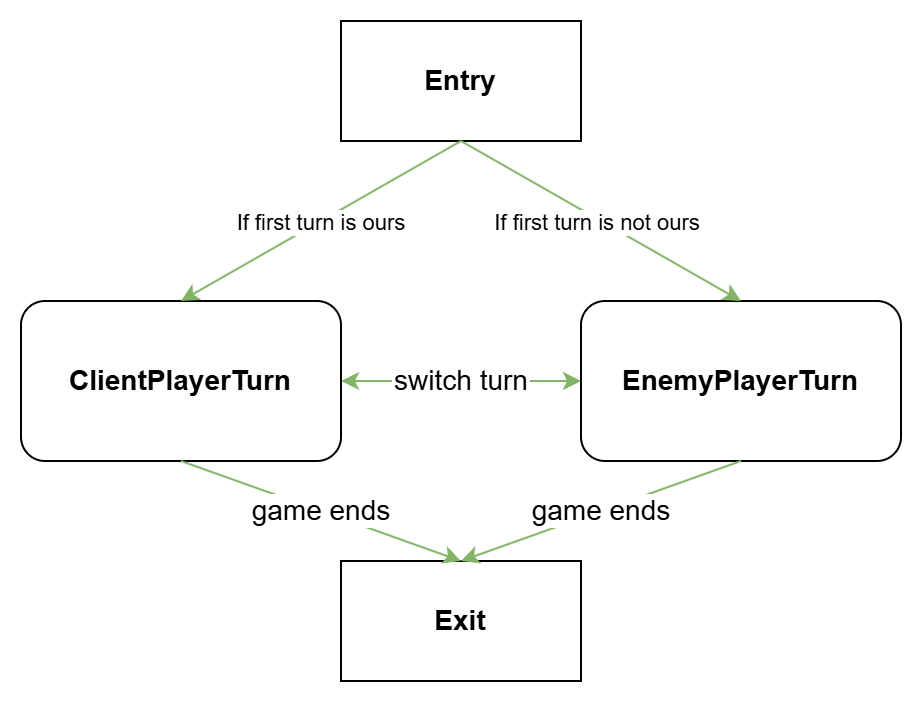

# MagicHeroes
Project where 2 characters using spells turn by turn. Has some client-server simulation, LifecycleFsm, MVP.

# Documentation for project

# Content
- [Foreward](#foreward)
- [Main Concepts](#main-concepts)
  - [Global Main Concepts](#global-main-concepts)
    - [Client Server Simulation Communication](#client-server-simulation-communication)
    - [Global App Lifecycle](#global-app-lifecycle)
  - [Client Main Concepts](#client-main-concepts)
    - [Connection Lifecycle](#connection-lifecycle)
    - [Battle Lifecycle](#battle-lifecycle)
- [Global Utils](#global-utils)
  - [Http Api](#httpapi)
  - [Lifecycle](#lifecycle)
- [Client](#client)
- [Folder Structure](#folder-structure)

## Foreward
Project dived by three folders that has Client, Server and GlobalUtils side.   
In this project client-server simulation is used. That means that the client and server communicate through
class named ClientServerAdapter with one method : Response sendRequest(Request request);   
Also Response/Request classes are self-descriptive analog for HTTP Request/Response.
2 of them have parameter named 'fields' with Dictionary<string, string> class
to provide parameters through ClientServerAdapter communication.   
Request class have name parameter that describe MessageHandler name on server side.   
Response class have status parameter that imitates HTTP Response status codes.   
All of these simplifications are simulation of HTTP Request/Response communication between server and client.
This behaviour can be described by real HTTP API for unity.   
GlobalUtils side folder contains all of these HTTP communication assumptions.   
Zenject used only for client side.   
For server side service locator pattern is used.   
For event handling, the client uses Short Polling method.
That means that the client periodically sends a request for new events.
In real client server architecture that can be realised through WebSockets.   
Also project contain GlobalLifecycle for all sides. Its classes stored in GlobalUtils folder.

## Main Concepts
  

### Global Main Concepts
  

#### Client Server Simulation Communication
  
At all client server communication can be described by next diagram :   

> One Server, many clients. On diagram there is one client only, but in reality there could be more of them.
> If Client/Server communication will be implemented by appropriate API, this application will be able to handle more than one client.

Message Broker is entity on server side that receive and redirect requests from client to correspond MessageHandler.

Event Handling realised through presenter that has method to poll the server for events.

#### Global App Lifecycle
Global app lifecycle controlled by GlobalLifecycleFsm that initializes in GlobalEntryPoint.

GlobalBootstrap state initializes global objects and this fsm itself.   
Loading state invoke scene load for gameplay, while in this state scene was loading.   
Gameplay state represent gameplay where battle was played. The main client logic of the app can be found here.

### Client Main Concepts
  

#### Connection Lifecycle
  

Connection Lifecycle controlled by ConnectionLifecycleFsm that initializes in BootstrapInstaller that locates in Zenject Project Context.
It can be described by following diagram.

This fsm controls client connection lifecycle. Entry is not a state, but it points on first set state.   
- Connected state - represent that the client is connected to server. There is logic of event polling can be found.
- DisConnected state - represent that the client is disconnected from the server. It controls WaitForConnectionUI when leaving, and entering this state.
Also when ConnectionLifecycleFsm in this state, client tries to connect to server every second.   

This object living in project context, which means that this object will not be destroyed when scene resets. 

#### Battle Lifecycle
Battle Lifecycle controlled by BattleLifecycleFsm that initializes in BattleLifecycleInstaller that locates in Zenject SceneContext in Gameplay scene.
Battle Lifecycle is controlling state of the battle. 
It can be described by following diagram.

Entry and Exit is states here.   
FirstPlayerTurn and SecondPlayerTurn states was inherited from PlayerTurn state.
PlayerTurn state contains SwitchPlayerStateHit, it allows states to switch each other on some end turn condition.  
When one of the turn states reached win condition, it means that game is ended and exit state was setting.  
Exit state was hit Reset trigger and scene starts reloading.  
This object living in scene, which means that on reloading scene this object will be reloaded too.

## Global Utils
This part of app contains global classes that belong to both sides Client/Server or to global initialization for project.
Also contains editor scripts.

### Editor
Editor scripts.
BootstrapSceneRunner script is used for fast play from Bootstrap scene.
After clicked(or ctrl + H) launches project from Bootstrap scene.
After click while launched return to scene that was opened before launch.   

### Global Connection
Has only one class ClientServerAdapter that the client and server uses for communicate. ClientServerAdapter is a singleton.

### HttpApi
Has Response/Request classes.  
Request class parameters:  
- string name - parameter that describe MessageHandler name on server side.
- Dictionary<string, string> fields - parameter that describe parameters for Client/Server communication.

Response class parameters:  
- int status - parameter that imitates HTTP Response status codes.
- Dictionary<string, string> fields - parameter that describe parameters for Client/Server communication.

Also has HttpAttributeNames class that contains attribute names that used in requests/responses
for provide parameters between Client and Server.

### Lifecycle
Contains classes that controls lifecycle, such as Fsm, FsmState, LifecycleMono.
Also has class GlobalEntryPoint that is entry point for all project.

## Client
That part of document present client part of project and includes all things that client app must have.

## Folder Structure
Cause app has a global structures, folders Scenes, Resources, Plugins, and other was moved out of there.
if Client was separate project, this folders would be here.

- Art 
- Develop
  - Character
  - Dto
  - EventConnection
  - Infrastructure
    - Installers
    - States
  - Presenter
  - SceneManagement
  - UI
  - View
- Prefabs

Description of some non-obvious folders :
- Event connection - folder that contain som client side classes that responsible for
client connection lifecycle, client event Receiving/Handling.
- Character - folder that contains classes that describes some information about entities in battle.

